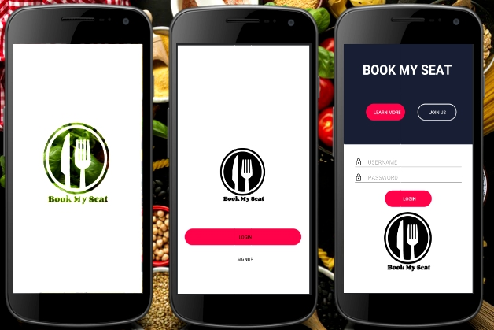

# Group-2

CSE299 - Junior design

Project Topic: Hostel, Restaurant Seat & food reservation App

Restaurant Booking System is a simple and easy-to-use online restaurant reservation system with all the functionality needed to reserve a table online.
You can easily manage guest inquiries, send emails and SMS reminders, and accept online payments and much more.

A restaurant reservation software with an easy web based and password protected admin panel accessible from any computer with an internet connection. Through the admin panel even users with no programming skills can manage reservations, table availability and payments and set email auto responder.

Build-up Language: Java (back-end), XML(front-end)

Semester: Spring'19

Faculty : Shaikh Shawon Arefin Shimon

North South University

GitHub Link: https://github.com/nsuspring2019cse299sec4/Group-2

Slack Channel: fall2019cse299sec4g2.slack.com

Trello Borad: https://trello.com/b/WOLFauFB/main

Gnatt chart: Gnatt chart is intregrated with Trello Board

Members:

1421068042	M. S. Arifin Khan Ahee	ahee.khan@northsouth.edu

1620952042	Md. Rashad Tanjim	rashad.tanjim@northsouth.edu

1621555030  Sanzar Rahman  sanzar.rahman@northsouth.edu

added activities:
SplashScreen
Login
Signup
Registration
HanderFirebase
Timeline
ShowRestaurant
Payment
Order
History
Catagoris
About 
Share App
